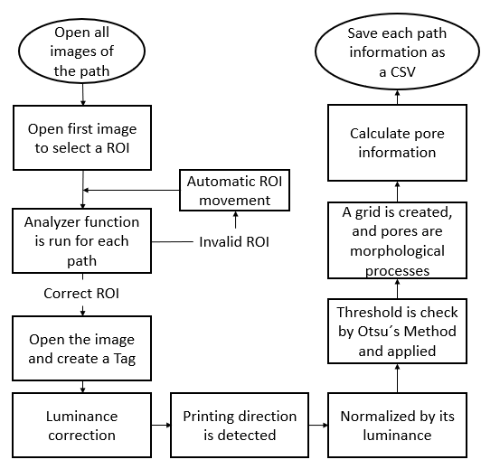

# PorMe

Image-based pore and porosity analysis for **orthogonal 3D-printed scaffolds**.  
PorMe processes layer-by-layer images (in-situ or post-process) to extract micro-architectural features such as **pore size, porosity, strut thickness,** and **spacing**.

> **Status:** actively developed and open-sourced. Interfaces may evolve.

---

## Currently in development for open-source users. 
To run the code, just go to:
- `src/porme/`

File `pore_analyzer_20220606.py` contain a python code that does the work.

## How this work?



Future work includes to properly set up the enviroment. For now, the following information is under development:

## What is this?
This repository contains a **skeleton** for your PorMe codebase, with:
- `src/porme/` — put your implementation here
- `examples/` — runnable scripts/notebooks (in development)
- `examples/data/` — workflow images and test images
- `docs/figures/` — figures for papers/docs (e.g., workflow diagram)
- `scripts/` — optional command-line entry points


## Requirements
- **Python 3.9**
- NumPy 1.23 • Pandas 1.5 • OpenCV 4.6 • Matplotlib 3.6  
  *(Install via `pip install -r requirements.txt`.)*


## Quick start
```bash
# (optional) create a virtual environment
python -m venv .venv && source .venv/bin/activate  # Windows: .venv\Scripts\activate

# install dependencies (fill requirements.txt with your own)
pip install -r requirements.txt

# run the basic example
python examples/01_basic_workflow.py
```

## License
- Code: MIT License (see `LICENSE`).
- Documentation & figures: Creative Commons Attribution 4.0 International (CC BY 4.0) (see LICENSE-docs).


## Citation
See `CITATION.cff` for a suggested citation entry.
